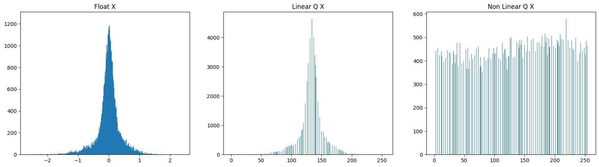

# 🧠 Enhanced Human

This repository contains the code developped by Neurobus for the Enhanced Human project. It allows pre-training and the real-time pipeline for inference of Akida and CPU models.

---

## 🧭 Table of Contents

- [Features](#features)
- [Installation](#installation)
- [Basic Usage](#basic-usage)
- [Quantization](#quantization)
- [Akida Constraints](#akida-constraints)
- [Next Steps](#next-steps)
---

## Features

- Pre-training and evaluation of Akida and CPU/GPU models, saving models and CSP objects.  
- Dataset pre-processing allowing for creating datasets of any possible combination of classes and for n-way classification
- Real-time inference pipeline for Akida and CPU/GPU models.
    - Reads input EEG data from usb port
    - Pre-process data (reshaping, filtering, quantization if needed)
    - Inference on CPU or Akida Chip
    - Sends POST request to server
- Modular EEG prediction strategy  
- Example of energy consumption calculation 

---

## Installation

Before proceeding to installation make sure to python and tensorflow versions that respect:
```
3.9 <= python <= 3.11
tensorflow <= 2.15
Keras <= 2.15
```
This will ensure compatibility with the BrainChip MetaTF frameworks, which can be installed using:
```
pip install akida==2.12.0
pip install cnn2snn==2.12.0
pip install akida-models==1.6.3
```

After this, you can continue installing dependencies as you see fit, or use the requirements.txt file:
```bash
# Install required packages
pip install -r requirements.txt
```

---
##  Basic usage

The main two ways to use this repository is either: Pre-training or realtime

### Pre-training:
To do pre-training, use the jupyter notebook `pre-training.ipynb`.
Before doing so, you can specify your configuration in either `config.py` or the first cell of `pre-training.ipynb`.
Detailed comments are included in the files to describe every parameter.  
After the desired configuration and models are set, run the jupyter notebook. This will result in plotting training and validation accuracies and saving the best models and CSP objects to `./saved_models`.
- models and CSP objects are named by using the first letter of the 2 classes (e.g. `LR.fbz` or `cspLR.pkl` for LeftVsRight model), this can be changed depending on the user's preferences and strategies.
#### Model saving:
- CPU/GPU models: these models are saved using a tensorflow format `model.tf`, CPU/GPU models naming contains the suffix `_cpu` to differentiate it from Akida models.
- Akida models: these models are first Quantized using `QuantizeML` and converted to akida models using `cnn2snn`. Then saved using the `akida` `akida.Model.save()` to an `model.fbz` format

#### CSP objects saving:
- CSP from the `mne` library are saved as python objects using `pickle`

---
### Real-time:

Real-time usage has been simplified by using modular strategies that could be defined in `strategies.py`.
For now, `Hierarchic_2Class` have been implemented which uses six 2 class models.  
To use the `realtime.py`, first define your strategy. A simple class form have been proposed, which uses only two methods:
- `strategy.load_models()` which will load the necessary models and objects for the given strategy and `strategy.predict()` which will take an EEG time epoch as input and returns a final direction.  
After defining the strategy and pre-training the models, instantiate your strategy object in `realtime.py` and use it as follows:
```python
# At the beginning, before the EEG streaming start
strategy = Hierarchic_2Class(model_type, using_chip)
strategy.load_models()
...
# Get the predicted direction
direction = strategy.predict(X) 
```
(More detailed comments can be found in code)  
Note: A base strategy class, and subclasses for specific strategies (inheritance) could be used to properly organize the `strategy.py` module.

Some important configuration parameters to set in the `realtime.py` script are:
```python
# The POST request server ip address and port
server_ip =  "http://192.168.69.53:8000"

# You can use simulated fake data if set to False
using_real_data = False

# You can test using the saved Akida models on CPU
using_chip = False


# Select from ['akida' , 'cpu']
model_type = 'cpu'
```

Finally, you can use:
```
python realtime.py
```
---

## Quantization
To use Akida models, both input data and models need to be quantized.  

### Input Quantization:
Input quantization should be performed by the user. When quantizing the model for the first time and each time the model is called for inference.  
For Akida V1, input should be quantized to `uint8` (e.g an integer in [0-255]).   
Many quantization strategies exist, the simplest one is Linear Quantization:
```python
Xq = ((X - X.min()) / (X.max() - X.min()) * 255).astype(np.uint8)
```
Other advanced non linear methods of quantization exist such as: Histogram Equalization, which uses the whole domain of numbers equaly:
```python
# using skimage library 
from skimage import exposure

X_norm = (X - X.min()) / (X.max() - X.min())
X_eq = exposure.equalize_hist(X_norm) 
```




### Model Quantization:
Model quantization is taken care of by the `QuantizeML` library. (Note: Make sure the keras model is in functional form)

```python
from quantizeml.models import QuantizationParams, quantize


# Quantization of the model using QuantizeML:
# 844 Quantization params which is compatible with version 1 Akida, inputs are 8 bits, while weights and activations are 4 bits
# Using 300 samples from Xq to calibrate the quantized model (see meta-tf/akida documentation website) 

qparams = QuantizationParams(input_weight_bits=8, weight_bits=4, activation_bits=4, per_tensor_activations=True)
quantized_model = quantize(functional_model, qparams=qparams, samples=Xq, num_samples=300, batch_size=64, epochs=10)

```

## Akida constraints

### Model conversion:

To convert a model to akida, the following constraints need to be respected:  

- Functional, Quantized Model
- Using only these Akida 1.0 layers (see this metaTF documentation [link](https://doc.brainchipinc.com/user_guide/akida.html#akida-layers)):
    - InputData
    - InputConvolutional
    - FullyConnected
    - Convolutional
    - SeparableConvolutional

(Note: Define models using Keras, other Deep Learning frameworks are not compatible natively, see metaTF documentation for how to convert to ONNX before converting to akida)

The use the `cnn2snn` library like this:


```python
from cnn2snn import convert, set_akida_version, AkidaVersion

with set_akida_version(AkidaVersion.v1):
    model_akida = convert(quantized_model)
```    

---
### Model Mapping:

The next step, is to map a converted model to an Akida Chip virtual or physical device.  
You can use Akida devices using:
```python
import akida

# For a virtual device Akida V1:
virtual_chip = akida.AKD1000()

# For a real chip:
chip = akida.devices()[0]


# Then map model using:
model_akida.map(chip) # or model_akida.map(virtual_chip)
```

Note: From my experience, mappin the model on a virtual chip does not allow the usage of the model as expected.

❗**Very important:** the `akida.Model.map()` method contains a very important parameter `hw_only`, which is set to `False` by default.  

If set to `True`:
```
model_akida.map(chip, hw_only=True)
```

It will force the mapping strategy to use only one hardware sequence, thus reducing software intervention on the inference.  
By default `False`, will potentially use multiple hardware sequences for different layers (parts of the network), and also CPU intereference between them.  
(Testing is needed to see which one is more efficient)

Using the flag `hw_only=True`, adds more constraints on the network architecture that are not explicitely found in the documentation, and be found by trial and error. Some of these constraints are:

- Kernel size should be in {3, 5, 7}, and symmetric
- Strides for input layer should be in {1, 2 or 3} and symmetric. For intermediary layers in {1,2} only.
- Input dimension cannot be smaller than 5 (e.g. input shape (3, 250) is not compatible). 
- Max input size is 256
- Convolution stride 2 only supported for 3x3 kernel size


---
## Next Steps

(In progress)